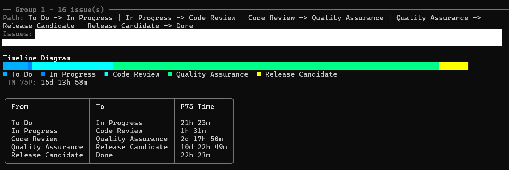

# JiraFlowInspector


JiraFlowInspector is a console analytics utility for tracking Jira issue transition flow.
It helps detect bottlenecks and compare transition paths with P75 timing.


## How the service works
1. Loads configuration from `appsettings.json` (`Jira` section).
2. Authenticates against Jira Cloud API using basic auth (`Email` + `ApiToken`).
3. Fetches issues that changed status to the configured done status since start of month.
4. Loads each issue changelog and builds transition timelines.
5. Optionally filters issues by configured Jira issue types.
6. Filters issues by required stage presence in the transition path.
7. Groups issues by transition path.
8. Calculates P75 transition duration per path.
9. Renders output tables:
   - Issues moved to done
   - Path groups with P75 timeline
   - Failure report (if any)

## appsettings.json parameters
### `Jira` section
Application options are under the `Jira` object.

- `BaseUrl` (`string`, required): Jira base URL (for example `https://your-company.atlassian.net`).
- `Email` (`string`, required): Jira account email used for authentication.
- `ApiToken` (`string`, required): Jira API token used for authentication.
- `ProjectKey` (`string`, required): Jira project key used in JQL filter.
- `DoneStatusName` (`string`, required): Target done status name used in JQL filter.
- `RequiredPathStage` (`string`, required): Stage that must be present in the issue transition path.
- `IssueTypes` (`string[]`, optional): Allowed Jira issue types filter (for example `["Bug", "Story"]`). When omitted or empty, all issue types are included.
- `MonthLabel` (`string`, optional): Label shown in the console filter summary (`yyyy-MM`); defaults to current UTC month when omitted.
- `CreatedAfter` (`string`, optional): Lower bound for issue creation date (`yyyy-MM-dd`); adds `created >= "<date>"` to JQL when provided.
- `RetryCount` (`int`, optional): Number of retries for transient Jira API failures (`0..10`, default `0`).

## Example configuration
```json
{
  "Jira": {
    "BaseUrl": "https://your-company.atlassian.net",
    "Email": "your-email@company.com",
    "ApiToken": "your-jira-api-token",
    "ProjectKey": "ABC",
    "DoneStatusName": "Done",
    "RequiredPathStage": "Code Review",
    "IssueTypes": ["Bug", "Story"],
    "CreatedAfter": "2026-01-01",
    "MonthLabel": "2026-02",
    "RetryCount": 2
  }
}
```

## Output


