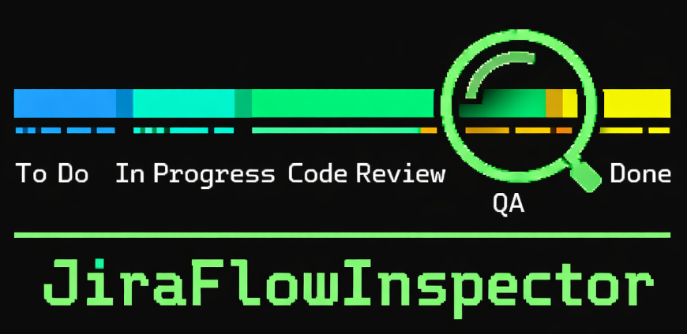
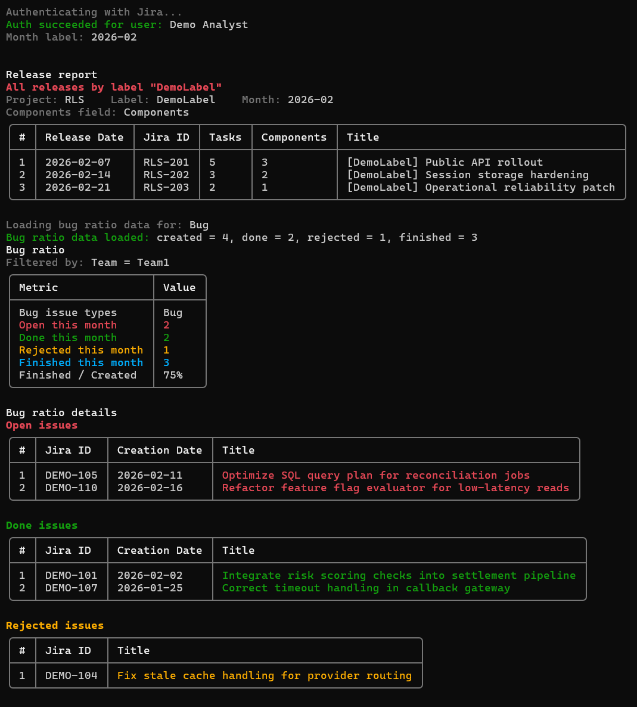
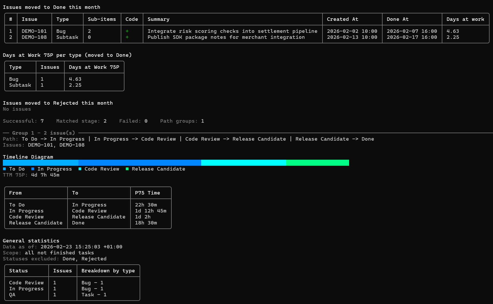
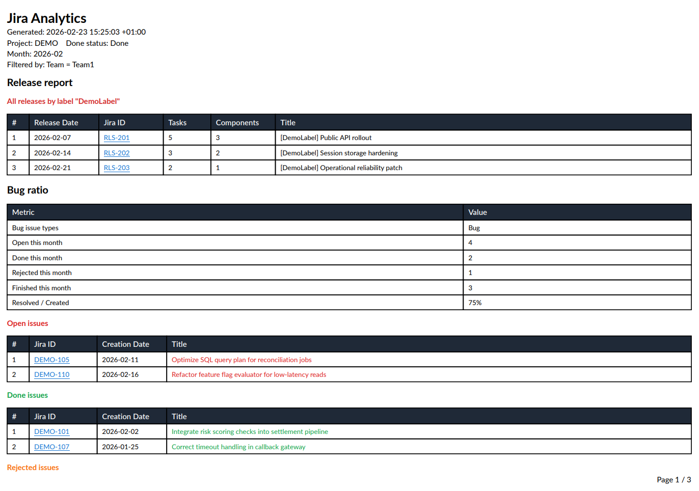
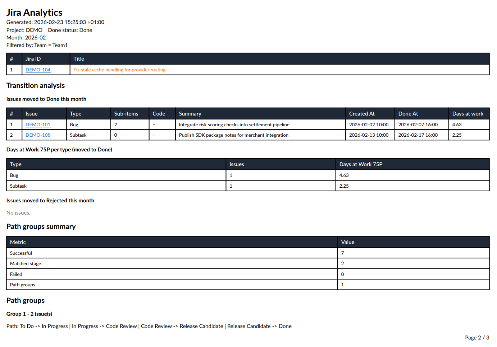
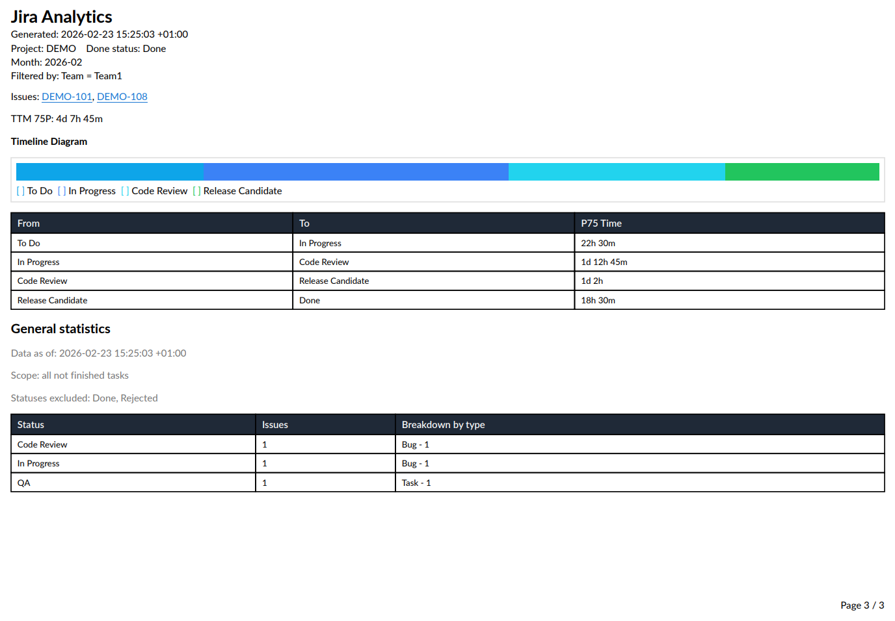

# JiraFlowInspector



JiraFlowInspector is a console analytics utility for Jira workflows.
It analyzes how issues move across statuses, highlights bug/release metrics, and can export the same report to PDF.

## Features

- Jira Cloud authentication with `Email` + `ApiToken`.
- Transition analytics for issues moved to `Done` in a selected month.
- Optional reject flow support (`RejectStatusName`).
- Optional bug ratio report with open/done/rejected/finished metrics.
- Optional release report by label and custom release date field.
- P75 transition timing per path group.
- Timeline diagrams in console and PDF.
- Optional exclusion of weekends and specific calendar days from duration calculation.
- Optional custom field filter (for team-level filtering).
- Optional retry policy for transient Jira API failures.
- Optional PDF export (QuestPDF), including clickable Jira links.

## What The App Does

1. Loads `Jira` settings from `appsettings.json`.
2. Authenticates with Jira.
3. Resolves reporting period from `MonthLabel` (or current UTC month if omitted).
4. Loads keys for issues that:
   `status CHANGED TO "<DoneStatusName>"` in month range
   and currently have `status = "<DoneStatusName>"`.
5. Optionally loads keys for `RejectStatusName` with the same final-status rule.
6. Optionally loads release issues for the month.
7. Optionally loads bug-ratio datasets.
8. Loads changelogs for selected issues and builds transition timelines.
9. Applies issue-type and required-stage filters.
10. Shows console sections.
11. Optionally writes PDF report.

## Important Behavior Rules

- Final status is required for done/rejected searches:
  issues that were moved to Done (or Reject) and later reopened are excluded.
- `CreatedAfter` applies to transition analytics key search only.
- `CustomFieldName` + `CustomFieldValue` are applied only when both are provided.
- Required stages use case-insensitive substring matching against both transition `From` and `To` statuses.
- Path grouping for transition analytics is built only from issues with detected code activity (`HasPullRequest = true`).

## Report Sections

### Console Output

- Report context:
  month, optional created-after date.
- Release report (optional):
  all releases in `MonthLabel` by `ProjectLabel`, with tasks/components counts.
- Bug ratio (optional):
  open/done/rejected/finished counts and finished/created rate.
- Bug ratio details (optional):
  separate tables for Open, Done, Rejected issues.
- Transition analysis:
  done table, optional rejected table.
- Path group summary:
  successful, matched stage, failed, path groups.
- Path groups:
  path, issue list, timeline diagram, P75 transition table.
- Failed issues table (when any request fails per issue).

All list tables include `#` index column.

### PDF Output

When `Jira:Pdf:Enabled` is `true`, PDF includes:

- Header (`Jira Analytics`, generation timestamp, project, done status, month, optional created-after/custom-field filter).
- Release report (if configured).
- Bug ratio (if configured) and bug detail tables.
- Transition analysis tables (Done and optional Rejected).
- Path groups summary.
- Path groups with timeline diagrams and P75 tables.
- Failed issues (if any).

Jira issue identifiers are clickable links in PDF sections:
release table, bug detail tables, done/rejected tables, path-group issue list, and failures table.

## Metrics Logic

### Transition Analytics

- Source set:
  issues moved to `DoneStatusName` during month and currently in that status.
- If `RejectStatusName` configured:
  rejected source set is loaded similarly.
- Issue types are filtered after loading timelines.
- Required path stages are enforced after issue-type filtering.
- Path groups are built from filtered issues with code activity only.
- P75 is calculated per transition index within each path group.

### Bug Ratio

`BugIssueNames` defines which issue types are treated as bugs.

- Open this month:
  bug issues created in month and not in finished set.
- Done this month:
  bug issues moved to `DoneStatusName` in month and currently in done status.
- Rejected this month:
  bug issues moved to `RejectStatusName` in month and currently in rejected status.
- Finished this month:
  union of Done and Rejected issue keys.
- Finished / Created:
  `finished / created * 100`.

### Release Report

Release query uses:

- `project = ReleaseProjectKey`
- `labels = ProjectLabel`
- `ReleaseDateFieldName` in `MonthLabel` range.

Per release row:

- `Tasks`:
  count of linked work items with relation text `is caused by` (both inward/outward links).
- `Components`:
  count from configured components field; fallback to standard Jira `components`.
  Supports array/string/object custom-field payloads.
- `0` task/component values are displayed as `-`.

## Duration Calculation

Transition durations come from time between consecutive status changes.

- If `ExcludeWeekend = true`, Saturday/Sunday time is removed.
- Any date in `ExcludedDays` is removed.
- Supported date formats in `ExcludedDays`:
  `dd.MM.yyyy` and `yyyy-MM-dd`.

## Pull Request Detection

Code activity (`HasPullRequest`) is detected from issue additional fields by searching for pull request data.
The detector checks configured pull request field (`PullRequestFieldName`);

## Configuration (`appsettings.json`)

All options live under `Jira`.

- `BaseUrl` (`string`, required):
  Jira base URL, for example `https://company.atlassian.net`.
- `Email` (`string`, required):
  Jira account email.
- `ApiToken` (`string`, required):
  Jira API token.
- `PullRequestFieldName` (`string`, optional):
  Jira field for detecting pull request activity.
- `TeamTasks` (`object`, required):
  transition and bug report settings.
- `TeamTasks.ProjectKey` (`string`, required):
  project used for transition and bug queries.
- `TeamTasks.DoneStatusName` (`string`, required):
  done status name.
- `TeamTasks.RejectStatusName` (`string`, optional):
  rejected status name.
- `TeamTasks.CustomFieldName` (`string`, optional):
  custom field name for filtering.
- `TeamTasks.CustomFieldValue` (`string`, optional):
  custom field value for filtering.
- `TeamTasks.IssueTransitions` (`object`, required):
  transition analysis settings.
- `TeamTasks.IssueTransitions.RequiredPathStages` (`string[]`, required, at least one):
  all stages must be present in issue transition path.
- `TeamTasks.IssueTransitions.IssueTypes` (`string[]`, optional):
  allowed issue types for transition analysis.
- `TeamTasks.IssueTransitions.ExcludeWeekend` (`bool`, optional, default `false`):
  exclude weekend time from durations.
- `TeamTasks.IssueTransitions.ExcludedDays` (`string[]`, optional):
  exact days excluded from durations.
- `TeamTasks.BugRatio` (`object`, optional):
  bug ratio settings.
- `TeamTasks.BugRatio.BugIssueNames` (`string[]`, optional):
  issue types treated as bug-like.
- `ReleaseReport` (`object`, optional):
  release report settings.
- `ReleaseReport.ReleaseProjectKey` (`string`, required when `ReleaseReport` used):
  project containing release issues.
- `ReleaseReport.ProjectLabel` (`string`, required when `ReleaseReport` used):
  label filter for releases.
- `ReleaseReport.ReleaseDateFieldName` (`string`, required when `ReleaseReport` used):
  Jira field display name storing release date.
- `ReleaseReport.ComponentsFieldName` (`string`, optional):
  Jira field name for components counting.
- `Pdf` (`object`, optional):
  PDF settings.
- `Pdf.Enabled` (`bool`, optional, default `true`):
  enables PDF generation.
- `Pdf.OutputPath` (`string`, optional, default `jiraflowinspector-report.pdf`):
  output file path.
  Actual file name gets date suffix `_<dd_MM_yyyy>` before extension.
- `MonthLabel` (`string`, optional, format `yyyy-MM`):
  reporting month, defaults to current UTC month.
- `CreatedAfter` (`string`, optional, format `yyyy-MM-dd`):
  created-date lower bound for transition source query.
- `RetryCount` (`int`, optional, range `0..10`, default `0`):
  retry attempts for transient transport failures.

## Example Configuration

```json
{
  "Jira": {
    "BaseUrl": "https://your-company.atlassian.net",
    "Email": "your-email@company.com",
    "ApiToken": "your-jira-api-token",
    "PullRequestFieldName": "customfield_123",
    "TeamTasks": {
      "ProjectKey": "AAA",
      "DoneStatusName": "Done",
      "RejectStatusName": "Reject",
      "IssueTransitions": {
        "RequiredPathStages": [ "Code Review", "Release Candidate" ],
        "IssueTypes": [ "Task", "Bug", "Subtask" ],
        "ExcludeWeekend": true,
        "ExcludedDays": [
          "01.01.2026",
          "02.01.2026"
        ]
      },
      "BugRatio": {
        "BugIssueNames": [ "Bug" ]
      },
      "CustomFieldName": "Team",
      "CustomFieldValue": "Team1"
    },
    "ReleaseReport": {
      "ReleaseProjectKey": "RLS",
      "ProjectLabel": "AAA",
      "ReleaseDateFieldName": "Change completion date",
      "ComponentsFieldName": "Components"
    },
    "Pdf": {
      "Enabled": true,
      "OutputPath": "jiraflowinspector-report.pdf"
    },
    "CreatedAfter": "2026-01-01",
    "MonthLabel": "2026-02",
    "RetryCount": 0
  }
}
```

## Build And Run

Prerequisite: .NET SDK with support for `net10.0`.

```bash
dotnet restore src/JiraMetrics.slnx
dotnet run --project src/JiraMetrics/JiraMetrics.csproj
```

Run tests:

```bash
dotnet test src/JiraMetrics.slnx
```


## Output Screenshot

>For demonstration purposes, the program output shown in the screenshots uses synthetic data to avoid exposing information from real repositories and users.


### Console



### PDF


